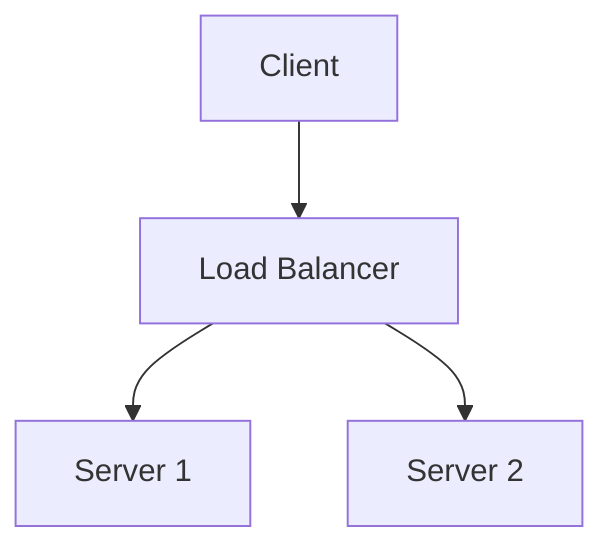
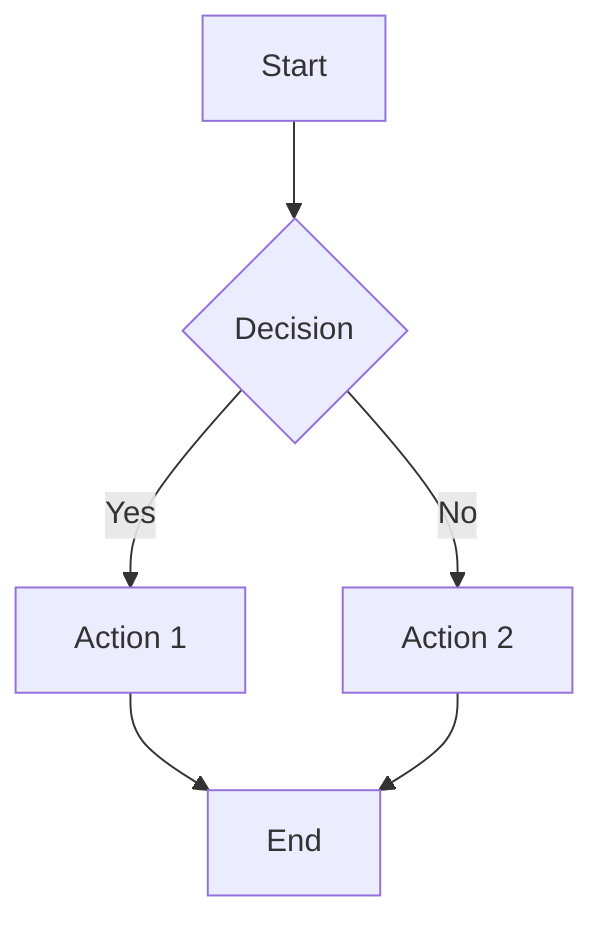
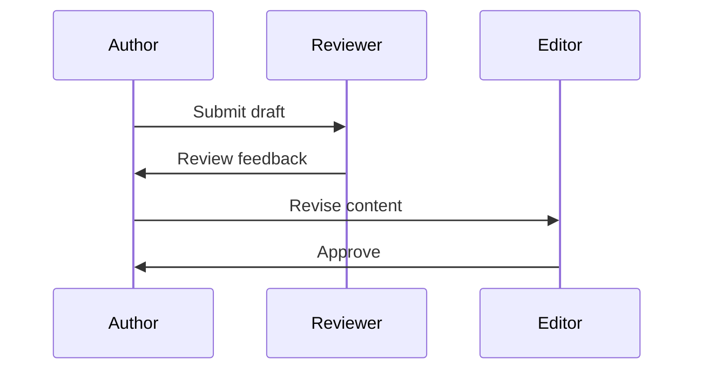
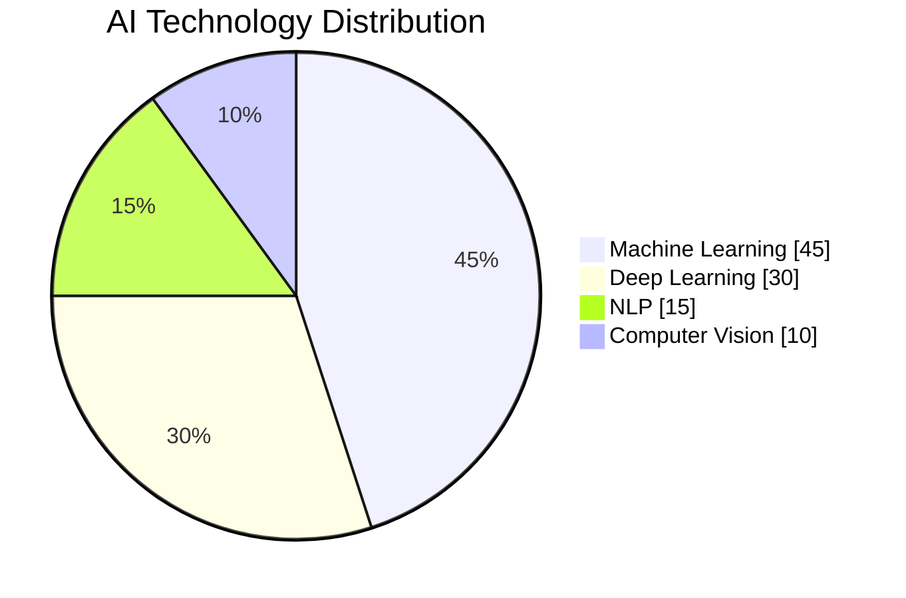

# Docusaurus Markdown Examples

This document demonstrates various Markdown features available in Docusaurus for creating rich content.

## Basic Formatting

Docusaurus supports all standard Markdown formatting:

- **Bold text** using double asterisks: `**Bold text**`
- *Italic text* using single asterisks: `*Italic text*`
- `Inline code` using backticks: `` `Inline code` ``
- ~~Strikethrough text~~ using double tildes: `~~Strikethrough~~`

## Headings

Use different heading levels to structure your content:

```markdown
## Main Section (H2)
### Subsection (H3)
#### Sub-subsection (H4)
```

## Lists

### Unordered List
```markdown
- First item
- Second item
  - Nested item
- Third item
```

- First item
- Second item
  - Nested item
- Third item

### Ordered List
```markdown
1. First step
2. Second step
3. Third step
```

1. First step
2. Second step
3. Third step

## Code Blocks

### Basic Code Block
Use triple backticks:

````
```javascript
function helloWorld() {
  console.log("Hello, world!");
}
```
````

### Code Block with Syntax Highlighting
Specify the language after the opening backticks:

```javascript
function fibonacci(n) {
  if (n <= 1) return n;
  return fibonacci(n - 1) + fibonacci(n - 2);
}
```

Other supported languages include:
- `python`
- `java`
- `cpp` (C++)
- `html`
- `css`
- `json`
- `yaml`
- `bash`

## Admonitions (Callout Blocks)

Docusaurus provides several types of callout blocks for emphasizing important information:

:::tip

This is a tip. Use for helpful suggestions or best practices.

:::

:::note

This is a note. Use for additional information or reminders.

:::

:::warning

This is a warning. Use for important information that requires attention.

:::

:::caution

This is a caution. Use for warnings about potential issues or dangers.

:::

## Math Expressions

Docusaurus supports LaTeX-style math expressions for mathematical notation.

For example:
- Inline math: $E=mc^2$
- Block math equations for complex formulas

## Diagrams with Mermaid

Create diagrams using Mermaid syntax:



Other Mermaid diagrams include flowcharts, sequence diagrams, Gantt charts, and more.

## Tabs

Display content in tabs:

import Tabs from '@theme/Tabs';
import TabItem from '@theme/TabItem';

<Tabs>
  <TabItem value="js" label="JavaScript" default>
    ```js
    console.log('Hello, JavaScript!');
    ```
  </TabItem>
  <TabItem value="py" label="Python">
    ```py
    print('Hello, Python!')
    ```
  </TabItem>
  <TabItem value="java" label="Java">
    ```java
    System.out.println("Hello, Java!");
    ```
  </TabItem>
</Tabs>

## Links

### Internal Links
Link to other pages in your documentation:

```markdown
[Link to Introduction](../intro)
```

### External Links
Regular Markdown links work as expected:

```markdown
[Visit Docusaurus website](https://docusaurus.io)
```

[Visit Docusaurus website](https://docusaurus.io)

External links automatically open in a new tab.

## Images

```markdown

```


## Embedding Content

### YouTube Videos
```jsx
import ReactPlayer from 'react-player'

<ReactPlayer url='https://www.youtube.com/watch?v=dQw4w9WgXcQ' />
```

### CodeBlock from File
You can reference code from external files:

```mdx
import Component from '@site/src/components/Component';

<Component />
```

## Custom Components

You can create and use custom React components in your Markdown files:

<details>
<summary>Click to expand details</summary>

Additional content that's hidden by default but can be expanded.

</details>

## Tables

| Feature | Description | Status |
|--------|-------------|---------|
| Markdown | Rich formatting support | ✅ |
| Math | LaTeX-based expressions | ✅ |
| Diagrams | Mermaid chart support | ✅ |

## Images and Diagrams

### Adding Images

Place your images in the `static/img/` directory and reference them using the `/img/` path:

```markdown

```

Docusaurus also supports advanced image features:

```markdown

```


### Creating Diagrams with Mermaid

Mermaid diagrams are supported directly in Docusaurus:



Other diagram types include:

#### Sequence Diagram


#### Pie Chart


## Next Steps

- Use these examples as a reference when creating your content
- Refer to the [official Docusaurus documentation](https://docusaurus.io/docs/markdown-features) for more features
- Follow the [Content Guidelines](./content-guidelines) for consistency